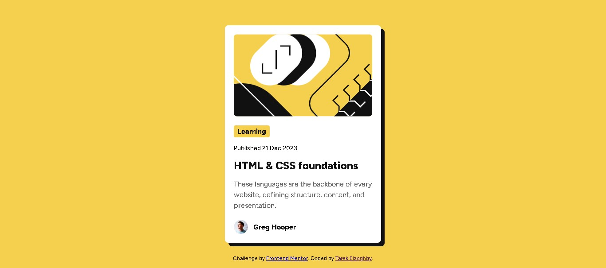

# Frontend Mentor - Blog preview card solution

## Overview

A single blog preview card component — illustration, category badge, publish date, linked title, description, and author row — built from a Frontend Mentor style guide specifying colors, Figtree font weights, and mobile (375px) / desktop (1440px) reference widths.

### Screenshot

### Links

- Solution URL: [github.com/Tarek-Elzoghby/frontend-mentor-challenges/tree/main/blog-preview-card](https://github.com/Tarek-Elzoghby/frontend-mentor-challenges/tree/main/blog-preview-card)
- Live Site URL: [tarek-elzoghby.github.io/frontend-mentor-challenges/blog-preview-card](https://tarek-elzoghby.github.io/frontend-mentor-challenges/blog-preview-card/)

## Process & decisions

The HTML was reviewed before any CSS was written. It held up well: `<article>` for the card, `<main>` as the sole landmark, `<time datetime="2023-12-21">` used correctly, and `alt=""` on both images since adjacent text already carried their meaning. One real discussion point came up — whether `<h1>` was the right level for the card's title, given it's the only content on the page. The call: heading level should reflect a piece of content's role in the document outline, not its visual size. `<h1>` is correct while this card is the page's only content, and would drop to `<h2>`/`<h3>` if it ever became one of several cards under a page-level heading.

Technical direction was set before any CSS: flexbox, mobile-first, one column flex on the card since the internal layout doesn't change shape across screen sizes — only the card's max-width and outer page padding do the responsive work. Grid was considered and set aside, since nothing here needs two-dimensional alignment.

A few decisions worth calling out specifically:

- **Flex centering host — `body` vs `main`.** `body` was rejected because it also holds the sibling `<footer class="attribution">`, and centering logic on `body` would implicitly pull the footer into a layout rule that isn't its concern. `main` was chosen since it's the landmark that actually owns "the primary content of this page."
- **Title link styling — descendant selector vs dedicated class.** A descendant selector (`.card__title a`) would silently depend on the HTML's current nesting without describing its own role. A dedicated class (`.card__title-link`) was chosen instead, staying consistent with BEM naming used throughout the rest of the file.
- **Badge stretching full-width — root cause and fix.** `.card__content` is a flex column, and flexbox's default `align-items: stretch` stretches children to fill the cross axis unless a child opts out. Two fixes were weighed: `align-self: flex-start` on the badge alone, or changing `.card__content`'s `align-items` for all children. Since only the badge needed different sizing while the rest of the content correctly wants full width, the one-off `align-self: flex-start` was the more precise fix.
- **Attribution footer centering.** First pass used `position: absolute; bottom: 1rem` with no horizontal centering, which left the text flush-left. Two approaches were weighed — `width: 100%; text-align: center` vs `left: 50%; transform: translateX(-50%)`. Since `.attribution` was already a full-width block-level footer rather than a box shrink-wrapped to its content, `text-align: center` was the more direct fit.

A couple of assumptions were checked against the actual reference screenshot rather than taken on faith:

- Whether the card's image would end up padded inconsistently against the text content, since it looked flush to the edges at first glance — checked directly, and it turned out to share the same inset as the rest of the card, so no change was needed.
- Whether `.card__date`'s color was right — a second-guess based on a general assumption about how these cards usually look, not the actual image. Re-checking the source screenshot confirmed the original was correct.
- Whether `.card`'s `overflow: hidden` (needed to clip the image to the card's rounded corners) would also clip the card's own box-shadow, since both live on the same element. Verified directly in the rendered output: it doesn't — `overflow: hidden` clips a child's overflowing content, not a shadow painted by the element itself.

The card's shadow was read from the screenshot as a solid, hard-edged shadow offset uniformly down and right — not a soft default blur — and converted to `box-shadow: 0.5rem 0.5rem var(--gray-950)`, with zero blur radius and rem units to stay consistent with the rest of the file.

Responsive behavior was checked across 320px–1440px in dev tools rather than assumed, confirming the single-breakpoint, no-media-query approach held for this design.

## Built with

- Semantic HTML5
- CSS custom properties
- Flexbox
- Mobile-first workflow

## What I learned

Heading levels should track document structure, not visual size — a single-content page can correctly use `<h1>` even for what would look like a small card heading elsewhere. Also confirmed a couple of times over this build that checking a visual assumption against the actual reference image beats reasoning about it in the abstract — both the image-padding question and the date-color second-guess turned out to be non-issues once actually checked, and `overflow: hidden` clipping child content but not the element's own shadow isn't obvious without verifying it directly.

## AI collaboration

AI helped surface structural options to weigh at a few decision points — the `body` vs `main` centering question, the two badge-stretch fixes, the two attribution-centering approaches — without making the calls itself. It also caught two concrete issues during the build: a leftover duplicate `overflow: hidden` declaration, and a class-name mismatch between the HTML's `card__avatar` and a CSS selector that had been written as `.card__author-image`. The decisions themselves — which option to take, and confirming or overriding assumptions against the actual screenshot — stayed with the developer.

## Author

- GitHub - [@tarek-elzoghby](https://github.com/tarek-elzoghby)
